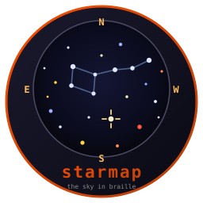
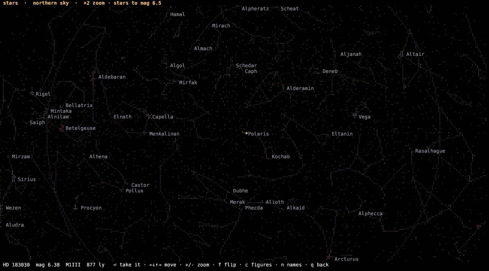

# starmap



  [](https://github.com/isene/fe2o3)

The naked-eye sky in a terminal, drawn in braille. Part of the
[Fe₂O₃](https://github.com/isene/fe2o3) Rust terminal suite.

Two tables live in the library, so nothing is fetched and nothing is
cached:

- **9,096 stars** from the Yale Bright Star Catalogue, with Hipparcos
  distances for 7,369 of them, plus B−V colour, spectral type, HD / HIP
  numbers and IAU proper names.
- **150 constellation strokes** from d3-celestial.



## Two skies

```rust
use starmap::{panel, Opts, Projection, View};

// What is over your head right now.
let sky = View::new(Projection::Horizon { lst_deg: 212.4, lat_deg: 59.9 });
print!("{}", panel(&sky, &Opts::default(), &[], 1, 1, 100, 30));

// The northern half of the celestial sphere, as a map.
let map = View::new(Projection::Hemisphere { north: true });
print!("{}", panel(&map, &Opts::default(), &[], 1, 1, 100, 30));
```

`Horizon` puts the zenith at the centre and the horizon at the rim, north
up and east to the left, which is what you get looking up rather than at
a map. `Hemisphere` puts the pole at the centre and the equator at the
rim, and reaches 30° past it so Orion stays whole on both halves.

Both are azimuthal equidistant, so zoom is a plain multiplication:

```rust
let mut v = View::new(Projection::Hemisphere { north: true });
v.zoom = 6.0;                       // six times in
v.pan = v.place(101.3, -16.7).unwrap();   // centred on Sirius
```

## Picking a star

```rust
if let Some(p) = starmap::pick(map, Opts::default(), "Pick a star") {
    println!("{} at {:?} pc", p.star.label(), p.star.dist_pc);
}
```

Arrows walk a crosshair, `+` / `-` zoom about it, `f` flips north and
south, `c` and `n` toggle the figures and the names, `0` resets, Enter
takes the star under the cross. The star nearest the crosshair is named
in the footer as you move, with its magnitude, spectral type and
distance in light years.

## What you get per star

```rust
pub struct Star {
    pub ra: f64, pub dec: f64,   // J2000 degrees
    pub mag: f64,                // apparent visual magnitude
    pub bv: Option<f64>,         // B−V colour index
    pub spectral: &'static str,  // "A1Vm"
    pub hd: u32, pub hip: u32,   // cross-ids, 0 if none
    pub dist_pc: Option<f64>,    // None where the parallax is not trustworthy
    pub name: &'static str,      // IAU proper name, or empty
}
```

`absmag()` gives absolute visual magnitude where the distance is known,
which is what an HR diagram needs. `label()` always returns something to
print: the proper name, else `HD 48915`, else `HIP 32349`.

Distance is `None` for 19% of the catalogue, either because the parallax
came out negative or because it is worse than 20% uncertain. Betelgeuse
is in that group: 7.63 ± 1.64 mas, which is exactly why its distance is
still argued about. The library says it does not know rather than
printing a number nobody should trust.

## Drawing your own things on it

`panel` takes a slice of `Body`, for anything that is not a catalogue
star:

```rust
let bodies = vec![starmap::Body {
    name: "jupiter".into(), ra: 128.4, dec: 19.2, rgb: (240, 205, 150), size: 1,
}];
```

That is how [astro](https://github.com/isene/astro) puts the sun, moon
and planets on the sky it draws for the selected hour.

## Cost

A frame is arithmetic over the two tables and one braille canvas: about
2 ms for a full screen, nothing at all between keypresses. The chart
scales how faint it goes to the room it has and the zoom it is at, so a
pane fifteen rows high shows the constellation stars and a full screen
shows the sky.

## Used by

- [astro](https://github.com/isene/astro) — the sky for the selected hour
- [stars](https://github.com/isene/stars) — pick a star off the sky and
  land on it in the Hertzsprung-Russell diagram

## Data

Yale Bright Star Catalogue (public domain), Hipparcos parallaxes (ESA
1997, via VizieR), IAU Catalog of Star Names, and d3-celestial's
constellation lines (BSD 3-clause, © Olaf Frohn). Full attribution in
[`data/README.md`](data/README.md).

## License

Public domain (Unlicense), except the constellation-line table, which
carries Olaf Frohn's BSD notice.

— [Geir Isene](https://isene.com)
